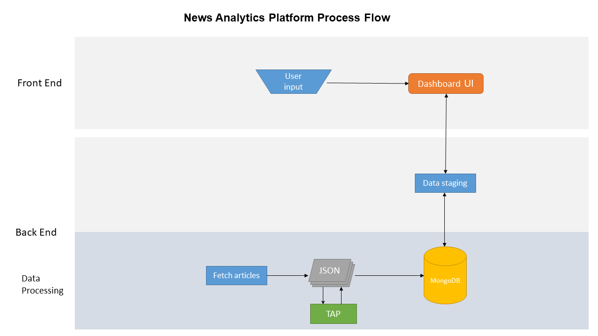

## News Scanning Application ##

## Tech Stack ##
Back end driven by PHP with some data staging performed in Python.  
Data stored in a NoSQL database (MongoDB).  

* [GPT-2](https://openai.com/blog/better-language-models/)
   * could use this to generate analysis.
* MongoDB
* [fivefilters.org](https://fivefilters.org/)
   * Utilizes the open-source code from FiveFilters to locally generate full-text RSS feeds

Google News API
* Key: 886a7bf4e2874674a45e3a0fa038d327
* Documentation: https://newsapi.org/docs/get-started

Google has an API for text analysis; USD$3/hr  
https://console.cloud.google.com/apis/library/language.googleapis.com?id=223648f2-2e7c-4acd-b0ca-782f9021a541&project=measurement-lab

Source Attributions:  
* Alyien API

    * Basic or free subscribers using the Aylien API and related Content or Data, shall agree to conspicuously display the Aylien API logo to indicate that Aylien technology is being used.  This graphic shall measure at least 200 by 100 pixels and be displayed on all web pages, documents or other renderings where Aylien API Content or API data is used.  In addition you provide a clickable hyperlink to Aylien which shall read: “Text Analysis by Aylien API” within your website or application. Similar attributions must be used in all published and/or printed works, including but not limited to research papers and journal articles.
