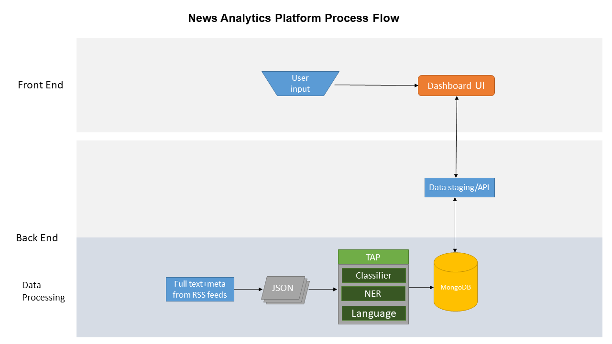

## News Scanning Application ##

## Launching a local instance ##
In the root directory is 'start_server.bat'. Opening this file will:
* launch a PHP and Mongo server, as well as an Anaconda command prompt.
* open Chrome to "localhost:8000" which displays "index.php"
* if the Mongo server crashes you need to delete the contents of "data/articles/" and relaunch the .BAT files

#### You can download PHP from [PHP.com](https://windows.php.net/download#php-7.3) ####
* choose "VC15 x64 Thread Safe" ZIP file
* extract the ZIP file to "C:\_LOCALdata\PHP"

#### You can download MongoDB from [this link](https://fastdl.mongodb.org/win32/mongodb-win32-x86_64-2008plus-ssl-4.0.10.zip) ####
* extract the ZIP file to "C:\_LOCALdata\MongoDB"
* place [mongo.config](http://gitlab.vnl1209.gov.ab.ca/special-projects/news-scanning/blob/620f6a1162d22eb74258c01e7aaf1831830f9db7/misc/mongo.config) in to "C:\_LOCALdata\MongoDB"
* you should also download [MongoDB Compass (Version: Community Edition, Platform: Windows 64-bit (Zip))](https://www.mongodb.com/download-center/compass)
    * extract the ZIP file into its own folder under "C:\_LOCALdata\MongoDB\"

## Tech Stack ##
Back end driven by PHP with some data staging performed in Python.  
Data stored in a NoSQL database (MongoDB).  

* [GPT-2](https://openai.com/blog/better-language-models/)
   * could use this to generate analysis.
* MongoDB
* [fivefilters.org](https://fivefilters.org/)
   * Utilizes the open-source code from FiveFilters to locally generate full-text RSS feeds

Google News API
* Key: 886a7bf4e2874674a45e3a0fa038d327
* Documentation: https://newsapi.org/docs/get-started

Google has an API for text analysis; USD$3/hr  
https://console.cloud.google.com/apis/library/language.googleapis.com?id=223648f2-2e7c-4acd-b0ca-782f9021a541&project=measurement-lab

Source Attributions:  
* Alyien API

    * Basic or free subscribers using the Aylien API and related Content or Data, shall agree to conspicuously display the Aylien API logo to indicate that Aylien technology is being used.  This graphic shall measure at least 200 by 100 pixels and be displayed on all web pages, documents or other renderings where Aylien API Content or API data is used.  In addition you provide a clickable hyperlink to Aylien which shall read: “Text Analysis by Aylien API” within your website or application. Similar attributions must be used in all published and/or printed works, including but not limited to research papers and journal articles.
